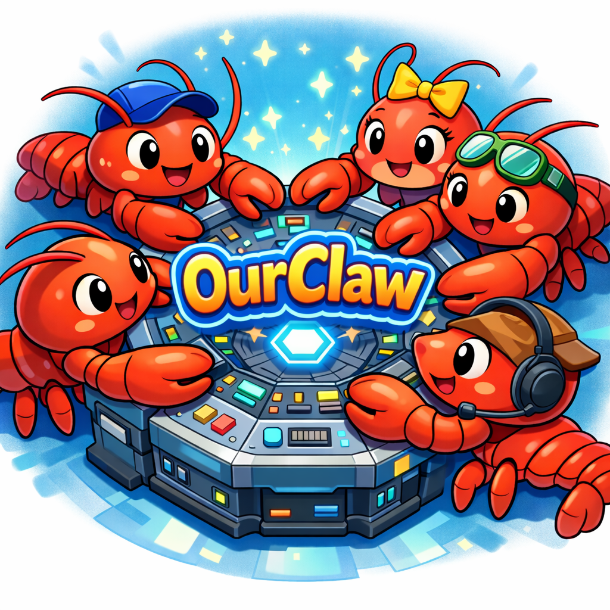
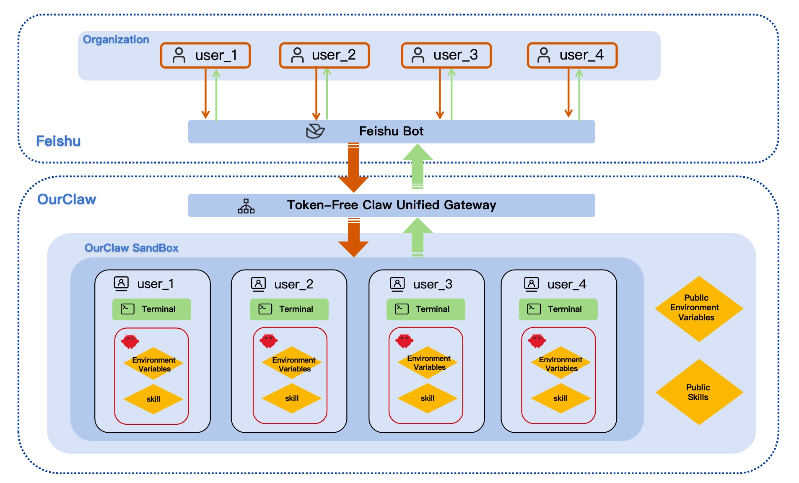

<div align="center">
  
  <h1>OpenMoss OurClaw</h1>
</div>

<p align="center">
  <strong>An organized OpenClaw solution. <br>
OurClaw: Single-bot, multi-backend sandbox setup with per-user workspace isolation.</strong><br>
</p>


<p align="center"><sub>中文ReadMe/Chinese version: <a href="./README_CN.md">README_CN.md</a></sub></p>



## When to Use OurClaw 

How can a team use OpenClaw elegantly at scale and turn collaboration into real productivity? How can you share your "lobster" workflows with others in your organization while still protecting privacy? OurClaw is built exactly for this.

| Solution | Deployment | Maintainability | Privacy |
|------|--------|--------|--------|
| Single bot + single OpenClaw ❌ | Easy ✅ | Good ✅ | Weak ❌ |
| Multiple bots + multiple OpenClaw ❌ | Complex ❌ | Poor ❌ | Strong ✅ |
| <span style="color:green">OurClaw (single bot + multiple OpenClaw)</span> ✅ | Easy ✅ | Good ✅ | Strong ✅ |


## Project Structure

- [`openclaw/`](./openclaw): OpenClaw source code
- [`openclaw-patch/`](./openclaw-patch): OpenClaw patches (currently only built-in TTS changes; if built-in TTS fails, copy the patch files into `openclaw/`)
- [`TFClaw/`](./TFClaw): TFClaw source code
- [`TFClaw/config.json`](./TFClaw/config.json): TFClaw runtime configuration
- [`commonworkspace/`](./commonworkspace): Shared workspace template
- [`restart_tfclaw_and_openclaw_users.sh`](./restart_tfclaw_and_openclaw_users.sh): Restart relay, gateway, and all user OpenClaw processes

## Prerequisites

- Node.js 
- `pnpm`
- `npm`
- `tmux`
- `jq`
- If you need to auto-create/manage mapped Linux users, running with root privileges is recommended.

## Start OurClaw

### 1. Install OpenClaw

```bash
bash installopenclaw.sh
```

Notes:

- Follow the original OpenClaw install flow and choose the Feishu channel. If OpenClaw is already installed locally, you can skip this step and directly replace the `openclaw/` folder in the repository root with your own.
- Because OpenClaw changed its own interfaces, this project currently supports the version updated on March 14.

### 2. Configure OpenClaw

Instead of maintaining one shared runtime `openclaw.json` directly, TFClaw generates an independent config for each user based on a template and override rules.

#### 2.1. Base template

Edit the file pointed to by `openclawBridge.configTemplatePath` in `TFClaw/config.json`.

Current value in this repository:

```text
~/.openclaw/openclaw.json
```

#### 2.2. Shared override config

If you want to inject unified `models` / `agents` settings for all users, only edit this file:

- [`commonworkspace/openclaw.json`](./commonworkspace/openclaw.json)

#### 2.3. Actual generated location

The final runtime config file for each user is generated at:

```text
TFClaw/.home/<linux-user>/.tfclaw-openclaw/openclaw.json
```

### 3. Install TFClaw

Based on the distribution infrastructure of [original Token-Free Claw](https://github.com/yxzwang/TFClaw).

```bash
bash installTFClaw.sh
```

Note:

- `./TFClaw/.runtime/openclaw_bridge/.env` is the shared environment variable file for all user OpenClaw instances.

### 4. Configure TFClaw

Edit [`TFClaw/config.json`](./TFClaw/config.json).

At minimum, check these fields:

- `relay.token`
- `relay.url`
- `openclawBridge.enabled`
- `openclawBridge.openclawRoot`
- `openclawBridge.sharedSkillsDir` (shared skills path)
- `openclawBridge.sharedEnvPath` (shared environment variables path)
- `openclawBridge.userHomeRoot`
- `openclawBridge.configTemplatePath`
- `channels.feishu.appId`
- `channels.feishu.appSecret`
- `channels.feishu.verificationToken`

Current defaults in this repository point to:

- OpenClaw source directory: `../openclaw`
- Shared skills directory: `../openclaw/skills`
- User home root: `TFClaw/.home`
- OpenClaw bridge state directory: `TFClaw/.runtime/openclaw_bridge`

## Start the Full Stack

Run this in the repository root:

```bash
./restart_tfclaw_and_openclaw_users.sh
```

The script performs the following in order:

1. Restart TFClaw relay
2. Restart OpenClaw processes for all mapped users
3. Restart TFClaw Feishu gateway
4. Run health checks

## Log Paths

- TFClaw relay log:
  [`./.runtime/tfclaw_runtime_logs/tfclaw_relay.log`](./.runtime/tfclaw_runtime_logs/tfclaw_relay.log)
- TFClaw gateway log:
  [`./.runtime/tfclaw_runtime_logs/tfclaw_gateway.log`](./.runtime/tfclaw_runtime_logs/tfclaw_gateway.log)
- Per-user OpenClaw log:

```text
TFClaw/.home/<linux-user>/.tfclaw-openclaw/logs/openclaw_gateway.log
```

## Shared Configuration Rules

### Rules for user `openclaw.json`

1. Read `openclawBridge.configTemplatePath` as the base template.
2. Read `commonworkspace/openclaw.json` as shared overrides.
   Currently only `models`, `agents.defaults`, and `agents.list` are overridden/injected.
3. Overlay TFClaw-enforced runtime parameters (`gateway` / `channels` / `skills` / `tools` / `env`, etc.).
4. Write the final result to each user's runtime file:
   `TFClaw/.home/<linux-user>/.tfclaw-openclaw/openclaw.json`

### Rules for `USER.md` and other model personalization files

1. Copy from `commonworkspace` first (preferred).
   Current path: `./commonworkspace`.
2. If `commonworkspace` does not exist, fall back to the OpenClaw template directory.
   Template directory: `./openclaw/docs/reference/templates`.
3. Seed only once when required (first run / empty directory, etc.), then write a marker.
