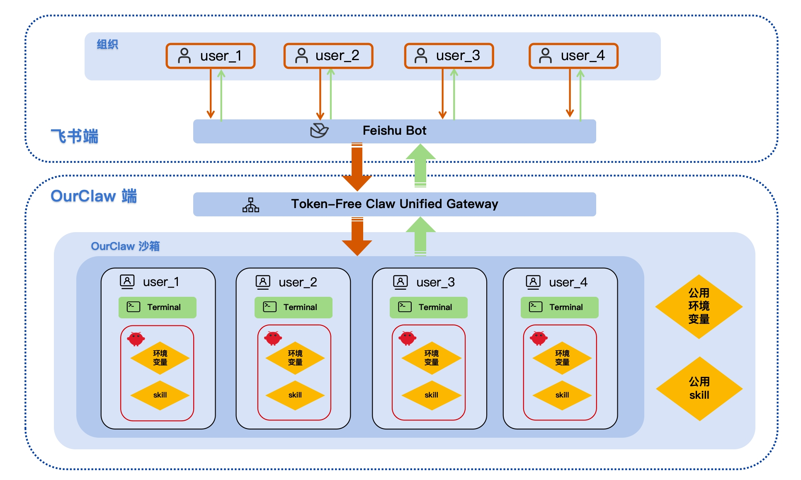

<h1 align="center">&nbsp; OpenMoss OurClaw</h1>

<p align="center">
  <strong> 
OurClaw: 组织化的 OpenClaw 方案. 单机器人多后台沙箱配置，提供用户空间隔离等功能。</strong><br>
</p>




## OurClaw的适用场景

如何优雅地多人使用Openclaw，团队化养虾化为实际生产力？如何给组织其他人分享自己的龙虾又保护自己的隐私？OurClaw正是你需要的。

| 方案 | 部署性 | 维护性 | 隐私性 |
|------|--------|--------|--------|
| 单机器人单Openclaw ❌| 容易 ✅ | 好 ✅ | 差 ❌ |
| 多机器人多Openclaw ❌| 复杂 ❌ | 差 ❌ | 强 ✅ |
| <span style="color:green">OurClaw (单机器人多Openclaw)</span> ✅ | 容易 ✅ | 好 ✅ | 强 ✅ |


## 目录结构

- [`openclaw/`](./openclaw)：OpenClaw 源码目录
- [`openclaw-patch/`](./openclaw-patch)：OpenClaw 补丁（目前只有内置tts改动，如果内置tts使用错误就复制到openclaw目录下）
- [`TFClaw/`](./TFClaw)：TFClaw 源码目录
- [`TFClaw/config.json`](./TFClaw/config.json)：TFClaw 运行配置
- [`commonworkspace/`](./commonworkspace)：公共 workspace
- [`restart_tfclaw_and_openclaw_users.sh`](./restart_tfclaw_and_openclaw_users.sh)：重启 relay、gateway 和所有用户 OpenClaw 进程

## 环境要求

- Node.js 
- `pnpm`
- `npm`
- `tmux`
- `jq`
- 如需自动创建 / 管理映射 Linux 用户，建议使用 root 权限运行

## OurClaw启动

### 1. 安装 OpenClaw
```bash
bash installopenclaw.sh
```


说明：

- 参考原本openclaw安装方法选择飞书端，如果本地已经安装过openclaw则可以跳过这一步，直接把自己的openclaw文件夹覆盖到根目录下。
- 因为openclaw改动了自己的接口，本项目目前支持的版本是3.14日更新的版本

### 2. 配置 OpenClaw

这里不是直接维护一份共享的运行时 `openclaw.json`，而是由 TFClaw 基于模板和覆盖规则，为每个用户生成独立配置。

#### 2.1. 基础模板

编辑 `TFClaw/config.json` 中 `openclawBridge.configTemplatePath` 指向的文件。

当前仓库里的配置值是：

```text
~/.openclaw/openclaw.json
```

#### 2.2. 公共覆盖配置

如果你希望给所有用户注入统一的 `models` / `agents` 配置，只看这一个文件：

- [`commonworkspace/openclaw.json`](./commonworkspace/openclaw.json)

#### 2.3. 实际生成位置

每个用户最终运行时使用的配置文件会生成到：

```text
TFClaw/.home/<linux-user>/.tfclaw-openclaw/openclaw.json
```

### 3. 安装 TFClaw
基于 [原版Token-Free Claw](https://github.com/yxzwang/TFClaw) 的分发设施。


```bash
bash installTFClaw.sh
```

说明：
- ,/TFClaw/.runtime/openclaw_bridge/.env是用户所有openclaw的公共环境变量

### 4. 配置 TFClaw

编辑 [`TFClaw/config.json`](./TFClaw/config.json)。

至少需要检查这些配置项：

- `relay.token`
- `relay.url`
- `openclawBridge.enabled`
- `openclawBridge.openclawRoot`
- `openclawBridge.sharedSkillsDir`  公用skills路径
- `openclawBridge.sharedEnvPath`    公用环境变量路径
- `openclawBridge.userHomeRoot`
- `openclawBridge.configTemplatePath`
- `channels.feishu.appId`
- `channels.feishu.appSecret`
- `channels.feishu.verificationToken`

当前仓库默认配置指向：

- OpenClaw 源码目录：`../openclaw`
- 共享 skills 目录：`../openclaw/skills`
- 用户 home 根目录：`TFClaw/.home`
- OpenClaw bridge 状态目录：`TFClaw/.runtime/openclaw_bridge`

## 启动整套服务

在仓库根目录执行：

```bash
./restart_tfclaw_and_openclaw_users.sh
```

这个脚本会按顺序执行：

1. 重启 TFClaw relay
2. 重启所有映射用户的 OpenClaw 进程
3. 重启 TFClaw Feishu gateway
4. 做健康检查

## 日志位置

- TFClaw relay 日志：
  [`./.runtime/tfclaw_runtime_logs/tfclaw_relay.log`](./.runtime/tfclaw_runtime_logs/tfclaw_relay.log)
- TFClaw gateway 日志：
  [`./.runtime/tfclaw_runtime_logs/tfclaw_gateway.log`](./.runtime/tfclaw_runtime_logs/tfclaw_gateway.log)
- 单用户 OpenClaw 日志：

```text
TFClaw/.home/<linux-user>/.tfclaw-openclaw/logs/openclaw_gateway.log
```

## 公用配置设置规则。

### 用户openclaw.json设置
  1. 先读 openclawBridge.configTemplatePath 作为基础模板
  2. 再读 commonworkspace/openclaw.json 做公共覆盖
     目前只覆盖/注入 models、agents.defaults、agents.list
  3. 然后再叠加 TFClaw 强制写入的运行参数（gateway/channels/skills/tools/env 等）
  4. 最终写到每个用户自己的运行文件：
     TFClaw/.home/<linux-user>/.tfclaw-openclaw/openclaw.json
     见 README.md:70

### User.md等模型个性化配置

 1. 先从 commonworkspace 拷贝（优先）
     当前会走到：./commonworkspace

  2. 如果 commonworkspace 不存在，才回退到 OpenClaw 模板目录
     模板目录：./openclaw/docs/reference/templates

  3. 只在“需要 seed”时拷一次（首次/空目录等），并写 marker
